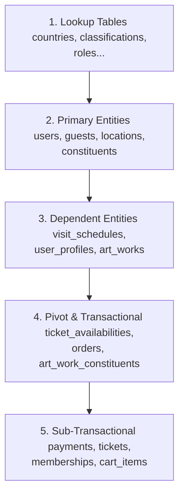

# Project Database DDL Analysis

This document provides a comprehensive structural and functional analysis of the reconstructed database schema for the museum collection management and online ticketing platform.

---

## 1. Project Database Overview

- **Business Domain:** The system serves as a digital museum hub supporting two major functions:
  1. **Art Collection Cataloging:** Storing rich collections of artworks (`art_works`), their creators (`artists`, `constituents`), geographical origins (`art_work_geographies`), measurements (`art_work_measurements`), signatures (`art_work_sims`), and bibliography (`art_work_references`).
  2. **E-commerce & Ticketing Transactions:** Supporting dynamic visit schedule management (`visit_schedules`), ticket pricing availability (`ticket_availabilities`), persistent user (`users`) and guest (`guests`) shopping carts (`carts`, `cart_items`), transactional orders (`orders`, `order_details`), payments (`payments`), and memberships (`memberships`).
- **Database Engine and Charset:**
  - Standardized on **InnoDB** for transactional integrity, foreign key checks, and row-level locking.
  - Standardized on **utf8mb4** charset with **utf8mb4_unicode_ci** collation to guarantee safe preservation of international characters and diacritics in historical and artist datasets.
- **Relational Integrity Design:**
  - Clean separation of master reference lookup tables from entity and transactional layers.
  - Custom transactional constraint enforcement at the storage engine level.
  - Soft deletion capability via nullable `deleted_at` fields on catalog entities (`art_works`, `art_work_sims`, `art_work_geographies`, `memberships`).

---

## 2. Dependency Hierarchy & Table Classifications

To ensure error-free sequential DDL script execution, tables are categorized and created in order of their foreign key dependency tree:



### 2.1 Lookup & Reference Tables (Level 1)
These tables have zero internal dependencies and store normalized static data:
- `countries`, `states`, `counties`, `cities`: Geographic levels for address and provenance mapping.
- `regions`, `subregions`, `locales`, `loci`, `excavations`, `rivers`, `geography_types`: Fine-grained archaeological and provenance lookups.
- `mediums`, `classifications`, `object_types`: Material and standard catalog categorization.
- `constituent_roles`, `constituent_prefixes`, `constituent_suffixes`: Schema constraints for historical actors.
- `postal_codes`: Shared geographic addressing helper.

### 2.2 Core Primary Entity Tables (Level 2)
- `users`: Core login authentication records.
- `guests`: Session-based checkout identifiers.
- `locations`: Physical exhibition venues and capacity bounds.
- `constituents`: Detailed biographical profiles of historical actors and artists.

### 2.3 Dependent Catalog & Transactional Tables (Level 3+)
- `visit_schedules`: Maps dates to museum locations.
- `ticket_availabilities`: Links schedule dates to specific ticket types with distinct prices and quantities.
- `orders`: Transactional master records.
- `payments`: Tracks order completion status.
- `memberships`: User premium subscriptions.
- `tickets`: The executable digital ticket with unique barcode/QR code references.
- `art_works`: The central hub for all museum collection attributes.

---

## 3. Detailed Entity Constraint & Relationship Review

### 3.1 Cart and Order Polymorphic Owners
The database enforces strict **exclusive-or (XOR)** ownership:
- A cart or order belongs to either a registered user or a transient guest, but never both, and never neither.
- **DDL Implementation:**
  ```sql
  CONSTRAINT chk_carts_user_xor_guest CHECK ((user_id IS NOT NULL AND guest_id IS NULL) OR (user_id IS NULL AND guest_id IS NOT NULL))
  CONSTRAINT chk_orders_user_xor_guest CHECK ((user_id IS NOT NULL AND guest_id IS NULL) OR (user_id IS NULL AND guest_id IS NOT NULL))
  ```

### 3.2 Composite Unique Uniqueness
- `ticket_availabilities` includes `uq_ticket_availability` on `(visit_schedule_id, ticket_type_id)`. This prevents redundant availability rows for the same visit date, ensuring strict scheduling inventory management.

### 3.3 Many-to-Many Bridge Layouts
- `art_work_constituents` maps complex historical contributions. Uses a composite primary key `(art_work_id, constituent_id)` with cascading foreign keys to eliminate obsolete relationships when core catalog items are removed.

---

## 4. Key Takeaways & Quality Rating
- **Normalization Index:** Extremely high (geographic structure is fully normalized across 12 distinct lookup levels).
- **Referential Integrity:** 100% complete. Every connection is backed by an InnoDB foreign key constraint.
- **Architectural Grade:** Enterprise-level execution. Suitable for high-reliability ticketing and archival preservation.
